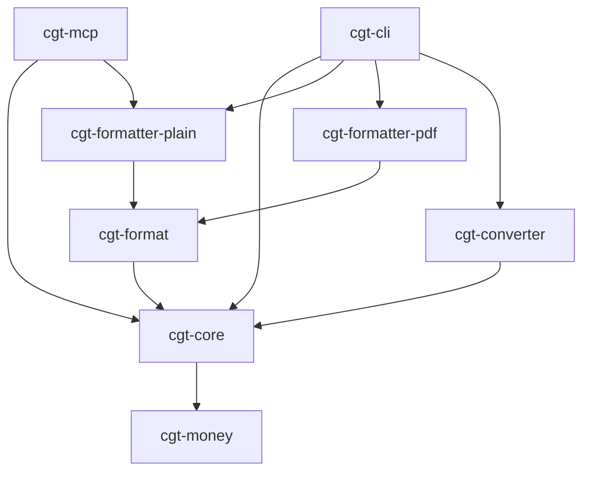

# Architecture

## Crate Dependency Flow

## Crates

| Crate                 | Purpose                                                                                                      |
| --------------------- | ------------------------------------------------------------------------------------------------------------ |
| `cgt-core`            | DSL parsing (pest grammar), HMRC matching rules, CGT calculation, data model. IO-free, WASM-compatible.      |
| `cgt-cli`             | CLI binary. Reads files, selects output format, writes results.                                              |
| `cgt-mcp`             | MCP server for AI assistants. Exposes parsing, calculation, and explanation tools over stdio JSON-RPC.       |
| `cgt-money`           | `CurrencyAmount` type and `FxCache` for HMRC monthly exchange rates. Bundled rates embedded at compile time. |
| `cgt-format`          | Shared formatting trait and UK-convention helpers (GBP formatting, dates, tax year display).                 |
| `cgt-formatter-plain` | Plain text report output.                                                                                    |
| `cgt-formatter-pdf`   | PDF report via embedded Typst templates.                                                                     |
| `cgt-converter`       | Broker CSV/JSON to DSL converters (Schwab transactions and equity awards).                                   |

## Design Principles

**IO-free core**: `cgt-core` and `cgt-money` perform no IO. All data is passed in. This enables WASM compilation and deterministic testing.

**Bundled FX rates**: HMRC exchange rates are embedded at compile time from CSV files in `data/`. Runtime override via `--fx-folder` loads XML files from disk.

**Golden-file testing**: Input `.cgt` files produce expected `.json` and `.txt` outputs. Tests compare actual output byte-for-byte against golden files.

**Single-pass matching**: Transactions are processed chronologically in O(N) with peek-forward for B&B matching and future consumption tracking.
