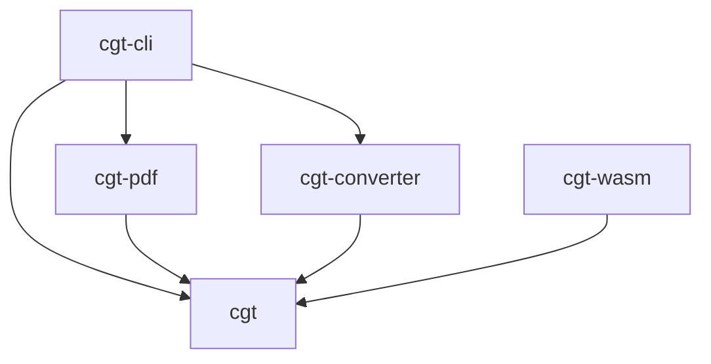

# Architecture

## Crate Dependency Flow

```mermaid
graph TD
    cgt-cli --> cgt
    cgt-cli --> cgt-pdf
    cgt-cli --> cgt-converter

    cgt-pdf --> cgt
    cgt-converter --> cgt
    cgt-wasm --> cgt
```

## Crates

| Crate           | Purpose                                                                                                                                                                                                                                 |
| --------------- | --------------------------------------------------------------------------------------------------------------------------------------------------------------------------------------------------------------------------------------- |
| `cgt`           | The engine: `CurrencyAmount`/FX cache (bundled HMRC rates), DSL parse + serialize (pest grammar), input validation, the plan-then-value matching engine, the `TaxReport` model, and the plain-text renderer. IO-free and WASM-friendly. |
| `cgt-pdf`       | PDF renderer using an embedded Typst engine with bundled fonts. Separate from `cgt` so WASM builds never pull in typst.                                                                                                                 |
| `cgt-cli`       | CLI binary (`cgt-tool`). Owns all file IO: reads `.cgt` inputs, loads custom FX folders, selects the output format, writes results.                                                                                                     |
| `cgt-wasm`      | WASM bindings exposing the engine to the browser/Node demo in `web/`.                                                                                                                                                                   |
| `cgt-converter` | Broker CSV/JSON to DSL converters (Schwab transactions and equity awards). String-in, string-out; no filesystem IO.                                                                                                                     |

## Design Principles

**Pure, IO-free engine**: `cgt` performs no IO. Inputs are passed in as strings and data; FX rates are embedded at compile time. This keeps the engine deterministic and WASM-compatible. Runtime FX override (`--fx-folder`) is handled by the CLI, which loads XML files and passes the parsed rates in.

**PDF kept separate**: Typst and its fonts are heavy. Isolating the PDF renderer in `cgt-pdf` keeps the `cgt`/`cgt-wasm` dependency graph light so the WASM bundle stays small.

**CLI owns IO**: file reading, FX-folder loading, output-path selection, and format dispatch live in `cgt-cli`. The library crates stay pure.

## Engine Pipeline: Plan, Then Value

The engine runs a fixed pipeline:

1. **Parse** — DSL text into typed transactions (pest grammar in `dsl/grammar.pest`).
2. **Validate** — reject malformed or ambiguous input before any calculation (e.g. a SPLIT/UNSPLIT on the same date as a BUY, SELL, or ACCUMULATION of the same ticker).
3. **Normalize** — convert foreign amounts to GBP via HMRC monthly rates, group transactions by day, and aggregate same-day same-ticker lots.
4. **Plan** — a single chronological pass builds a *quantity-only* match plan: same-day, then Bed & Breakfast (with reservations and split-ratio mapping across intervening reorganisations), then Section 104. No money is touched here.
5. **Value** — a second chronological pass replays the timeline to price each planned leg against the pool as it stood on the disposal date.
6. **Report** — assemble the `TaxReport`.

Separating quantity planning from valuation is what structurally prevents the retroactive-cost-leak: because each disposal is priced from the pool state at its own date, a corporate action dated *after* a disposal can never alter a leg that already occurred. A CAPRETURN or ACCUMULATION following a matched disposal adjusts only the carried-forward Section 104 holding, not the disposed leg.

## Single Report Model

All outputs project from one `TaxReport` value. The plain-text renderer (in `cgt`), the PDF renderer (`cgt-pdf`), and the JSON serialization all read the same model, so the three formats cannot drift.

## Testing Strategy

**Golden-file tests**: each input `.cgt` produces an expected `.json` (in `tests/json/`) and plain-text `.txt` (in `tests/plain/`). Tests compare actual output byte-for-byte against the golden files.

**Equivalence harness**: cross-validates results against external calculators (`scripts/cross-validate.py`) to catch divergence from independent implementations.
