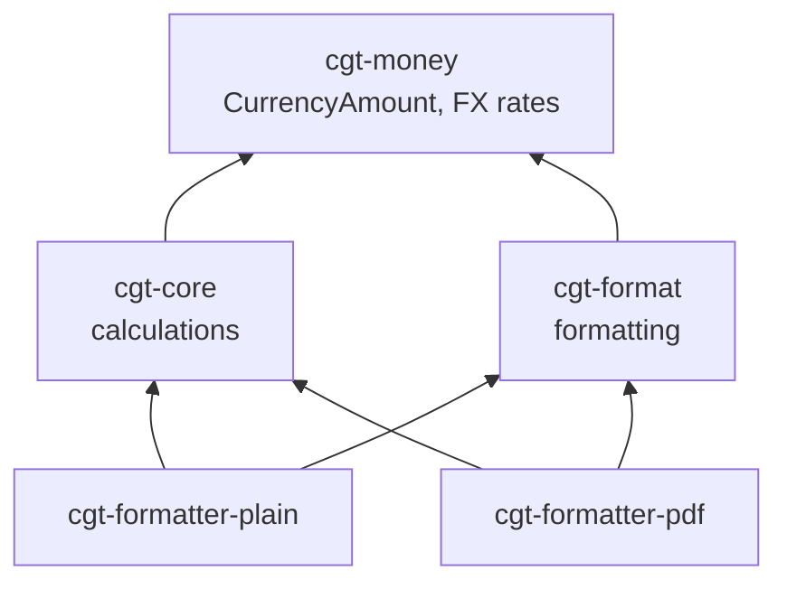

# Change: Restructure Crates for Clear Responsibilities

## Why

- `cgt-core` currently mixes calculation logic with formatting utilities and currency types, violating single-responsibility.
- `CurrencyAmount` lives in `cgt-core/models.rs` but is fundamentally a currency primitive, not a calculation type.
- Formatting is duplicated across formatter crates with ad-hoc helpers; no shared formatting crate exists.
- `cgt-fx` name suggests only FX rates, but it should own all currency primitives including `CurrencyAmount`.

## What Changes

1. **Rename `cgt-fx` → `cgt-money`**: Owns currency primitives (`CurrencyAmount`), FX rates, and `iso_currency` dependency.
2. **Move `CurrencyAmount`** from `cgt-core/models.rs` → `cgt-money`.
3. **Create `cgt-format`**: New crate for all formatting—move `cgt-core/formatting.rs` here, add `CurrencyFormatter` with idiomatic API, symbol fallback, and `CurrencyAmount` display helpers.
4. **Update `cgt-core`**: Remove `formatting.rs`, depend on `cgt-money` for `CurrencyAmount`.
5. **Update formatters**: Depend on `cgt-format` instead of `cgt-core::formatting`.

## Dependency Graph

## Impact

- Specs: Add `cgt-money` and `cgt-format` capability specs; update `plain-formatter` and `pdf-formatter` to reference shared formatter.
- Code: Rename crate, move types, create new crate, update imports across the workspace.
- Tests: Update imports; regenerate fixtures if output changes.

## Decisions

- `cgt-money` owns `CurrencyAmount` and `iso_currency`; `cgt-format` depends on `cgt-money` for display.
- `cgt-core` focuses purely on calculations (matching, gains/losses, tax rules).
- `cgt-format` provides `CurrencyFormatter` with `format_amount` (rounded totals) and `format_unit` (preserves precision).
- Symbol fallback: ISO code when symbol is empty/unavailable.
- Rounding: midpoint-away-from-zero to currency minor units (HMRC penny rounding).
