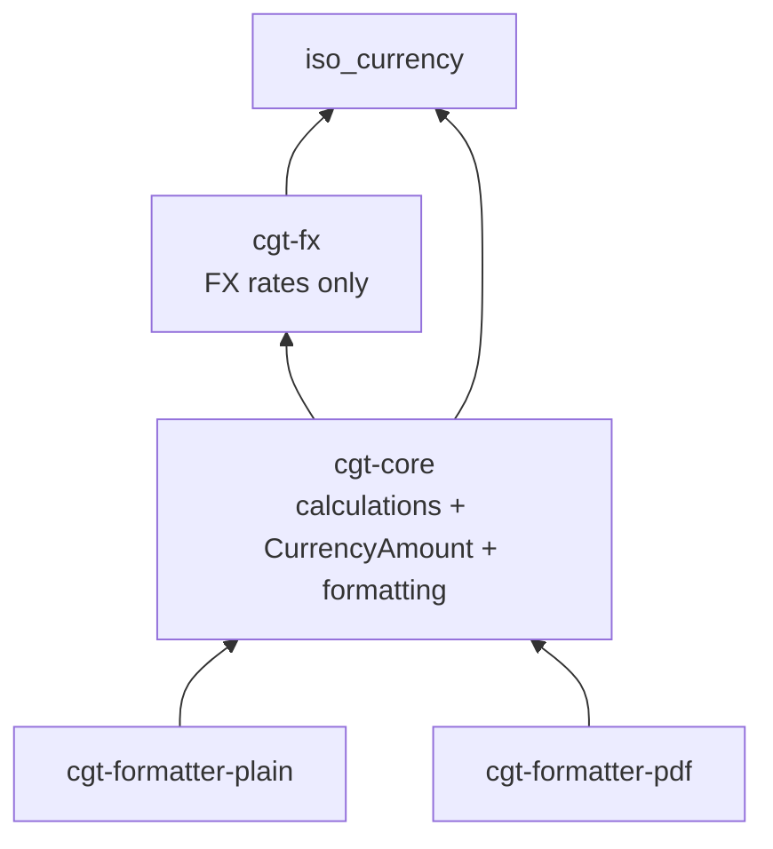
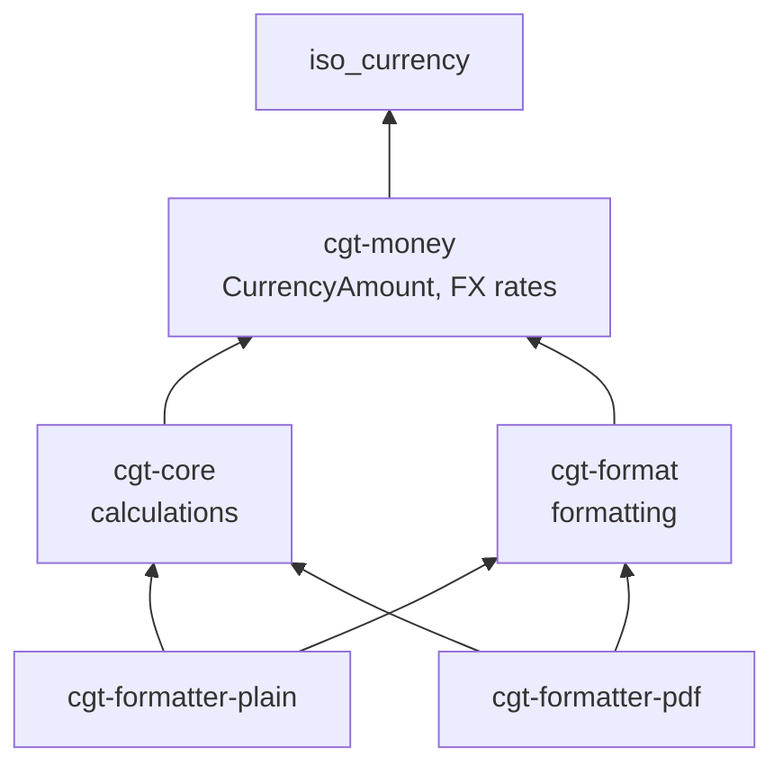

# Design: Restructure Crates for Clear Responsibilities

## Current State

### Problems

1. **Mixed concerns in `cgt-core`**: Contains calculation logic, formatting utilities, and `CurrencyAmount` type—three distinct responsibilities.

2. **`CurrencyAmount` misplaced**: Lives in `cgt-core/models.rs` but is fundamentally a currency primitive. It depends on `iso_currency` but has no relationship to CGT calculation logic.

3. **`cgt-fx` naming**: Suggests only FX rates, but logically should own all currency primitives.

4. **Duplicated formatting**: Both `cgt-formatter-plain` and `cgt-formatter-pdf` will need similar formatting logic. Currently `cgt-core/formatting.rs` exists but ad-hoc helpers are still created in formatters.

### Current Dependencies



## Proposed Architecture

### New Crate Structure

```
cgt-money/           # Currency primitives (renamed from cgt-fx)
├── CurrencyAmount   # Moved from cgt-core/models.rs
├── FxCache          # Existing FX rate lookup
├── RateEntry        # Existing rate types
└── iso_currency     # Re-exported

cgt-format/          # All formatting (new crate)
├── CurrencyFormatter
├── format_currency()
├── format_date()
├── format_tax_year()
├── format_decimal()
└── FormattingPolicy

cgt-core/            # Pure calculations
├── models.rs        # TaxPeriod, Transaction, Disposal, etc.
├── calculator.rs    # CGT calculation
├── matcher/         # Share matching rules
└── parser/          # DSL parsing

cgt-formatter-plain/ # Plain text output (depends on cgt-format)
cgt-formatter-pdf/   # PDF output (depends on cgt-format)
```

### New Dependencies



## Detailed Design

### cgt-money (Renamed from cgt-fx)

**Responsibilities:**

- `CurrencyAmount`: Monetary value with currency and GBP equivalent
- FX rate loading, caching, conversion
- Re-export `iso_currency::Currency`

**Public API:**

```rust
// Currency primitives
pub struct CurrencyAmount { amount, currency, gbp }
impl CurrencyAmount {
    pub fn gbp(amount: Decimal) -> Self;
    pub fn foreign(amount: Decimal, currency: Currency, gbp: Decimal) -> Self;
    pub fn is_gbp(&self) -> bool;
    pub fn minor_units(&self) -> u16;
    pub fn symbol(&self) -> String;
    pub fn code(&self) -> &'static str;
}

// FX rates (existing)
pub struct FxCache { ... }
pub fn load_default_cache() -> Result<FxCache, FxLoaderError>;
pub fn load_cache_with_overrides(...) -> Result<FxCache, FxLoaderError>;
```

### cgt-format (New)

**Responsibilities:**

- Currency formatting with symbol, thousands separators, rounding
- Date formatting (UK convention DD/MM/YYYY)
- Tax year formatting (YYYY/YY)
- Decimal formatting (fixed precision, trimmed)

**Public API:**

```rust
/// Policy for formatting (locale settings).
pub struct FormattingPolicy {
    pub currency_symbol: char,
    pub date_format: String,
    pub use_thousands_separator: bool,
}

/// Currency formatter with configurable rounding.
pub struct CurrencyFormatter {
    policy: FormattingPolicy,
}

impl CurrencyFormatter {
    pub fn uk() -> Self;

    /// Format amount rounded to currency minor units.
    /// For totals, proceeds, costs.
    pub fn format_amount(&self, amount: &CurrencyAmount) -> String;

    /// Format amount preserving full precision.
    /// For unit prices where precision matters.
    pub fn format_unit(&self, amount: &CurrencyAmount) -> String;

    /// Format raw decimal as currency.
    pub fn format_decimal(&self, value: Decimal) -> String;
}

// Standalone functions (convenience)
pub fn format_currency(value: Decimal) -> String;
pub fn format_currency_with_minor_units(value: Decimal, symbol: char, minor_units: u32) -> String;
pub fn format_decimal(value: Decimal) -> String;
pub fn format_decimal_fixed(value: Decimal, precision: u32) -> String;
pub fn format_date(date: NaiveDate) -> String;
pub fn format_tax_year(start_year: u16) -> String;
```

### cgt-core (Simplified)

**Removed:**

- `formatting.rs` module → moved to `cgt-format`
- `CurrencyAmount` type → moved to `cgt-money`

**Kept:**

- `models.rs`: TaxPeriod, Transaction, Operation, Disposal, Match, etc.
- `calculator.rs`: CGT calculation engine
- `matcher/`: Share matching rules (Same Day, B&B, Section 104)
- `parser/`: DSL parsing
- `config.rs`, `exemption.rs`, `error.rs`

**New dependency:**

- `cgt-money` for `CurrencyAmount`

### Formatter Crates

**Changes:**

- Depend on `cgt-format` instead of `cgt-core::formatting`
- Remove ad-hoc formatting helpers (e.g., `format_unit_amount` in plain formatter)
- Use `CurrencyFormatter` for consistent formatting

## Migration Strategy

1. **Create `cgt-money`** by renaming `cgt-fx` directory and Cargo.toml
2. **Move `CurrencyAmount`** from `cgt-core/models.rs` to `cgt-money/src/amount.rs`
3. **Create `cgt-format`** as new crate
4. **Move `formatting.rs`** from `cgt-core` to `cgt-format`, add `CurrencyFormatter`
5. **Update imports** across all crates
6. **Remove ad-hoc helpers** from formatter crates
7. **Run tests** to verify no regressions

## Rounding Behavior

All currency formatting uses midpoint-away-from-zero rounding to the currency's minor units (typically 2 for GBP). This matches HMRC penny rounding expectations.

```rust
// £100.995 → £101.00 (rounds up)
// £100.994 → £100.99 (rounds down)
```

## Symbol Fallback

When a currency's symbol is empty or unavailable, use the ISO code:

```rust
fn get_symbol(currency: Currency) -> String {
    let sym = currency.symbol();
    if sym.is_empty() {
        currency.code().to_string()
    } else {
        sym.to_string()
    }
}
```
